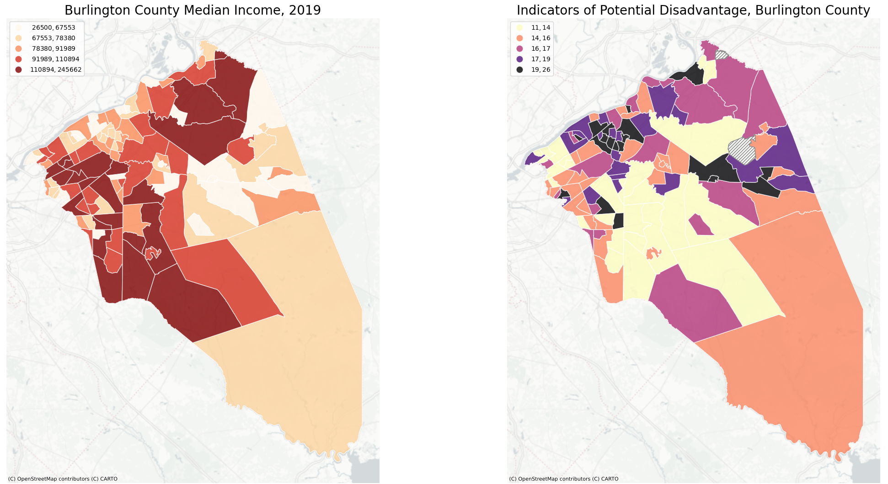
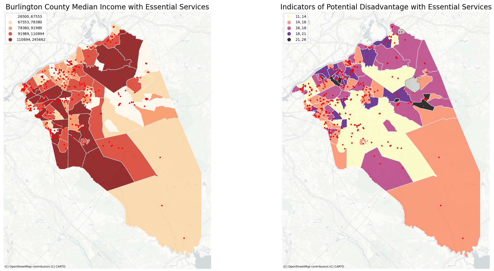
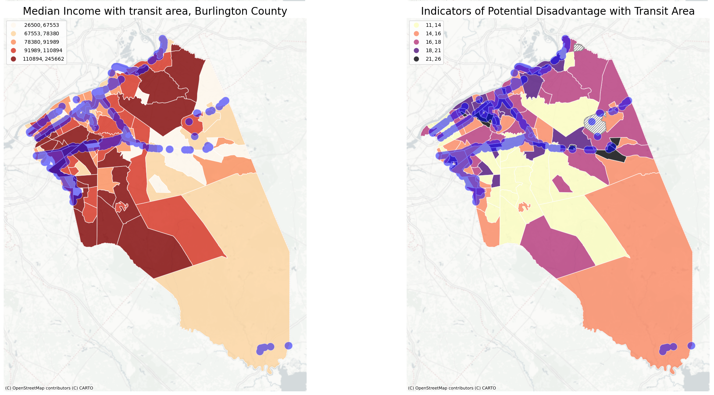

<html lang="en">
<head>
    <meta charset="UTF-8">
    <meta name="viewport" content="width=device-width, initial-scale=1.0">
    <title>Understanding Accessibility</title>
</head>
<body>
    <h1>Understanding Accessibility</h1>
    

    
<em>By Shalmali Bapat (MCRP), Edward J Bloustein School of Planning and Public Policy, Rutgers University</em>

    <h2>Research Question:</h2>
    
Are the essential services and transit area (0.5 mile as walkable distance) distributed equitably? Are they located in areas with population potentially at disadvantage and low-income census tracts?

    <h2>Objective:</h2>
    
To map the spatial distribution of essential services and transit area in Burlington County and overlay it over median income and indicators of potential disadvantage at census tract level

    <h2>Datasets:</h2>
    <ul>
        <li><strong>Median Income</strong> | Source: American Community Survey (5-year estimates), 2015-2019</li>
        <li><strong>Indicators of Potential Disadvantage</strong> | Source: DVRPC Open Data Center, 2021</li>
        <li><strong>Equity through access (or Essential Services)</strong> | DVRPC Data Center</li>
        <li><strong>Transit services</strong> | Rail Stations of NJ Transit (NJGIN), Bus Stops of NJ Transit by Line (NJGIN), Light Rail Stations of NJ Transit (NJGIN), Path Station Locations (NYC Open Data), Passenger Rail Stations (in the DVRPC area, filtered before export to only PATCO stations in NJ, not SEPTA on the PA side or the NJ Transit RIVER line since we have it above in Light Rail Stations)</li>
    </ul>
    <h2>Spatial distribution of median income and potential disadvantaged population</h2>
    
The median income estimates from $25,500 to $245,662 in Burlington County. They are mapped using natural breaks method. The map shows the distribution of median income by census tracts where the darker color shows higher income and lighter shades indicate census tracts with lower income. The indicator of potential disadvantage shows the census tracts with potential vulnerable population. The darker shades indicate higher vulnerability of population in the respective census tract. In simple language, the higher IPD score indicates higher need by population and vice versa.

 
    <h2>Spatial Distribution of Essential Services in relation to median income and potentially disadvantaged population</h2>
    
Observing the distribution of essential services over both the maps, we can conclude that essential services are unevenly distributed across the county. They are more concentrated on the west side of the county, where both income and potentially disadvantage census tracts are distributed. However, the north end shows limited essential services. The east of the county is predominantly forest cover, thus, limited coverage of essential services.

     
    <h2>Spatial Distribution of Transit service area in relation to median income and potentially disadvantaged population</h2>
    
The transit stops with 0.5 mile area acting as service area are also unevenly distributed. They are mainly concentrated on the west side of the county. The south and north end are barely catered to.

      
    <h2>Conclusion:</h2>
    
The accessibility to services and transit is limited in north and south census tracts of the County. The census tracts on the north show potentially disadvantage population who are not catered by the essential services and transit services. Thus, limited accessibility to services within these communities.

    <h2>Interactive map to view the type of services and coverage of transit service area in Burlington County</h2>
    
You can explore this map <a href="interactive_map.html">as its own web page here</a>.

    <iframe src="interactive_map.html" height="900" width="1200"></iframe>
</body>
</html>
